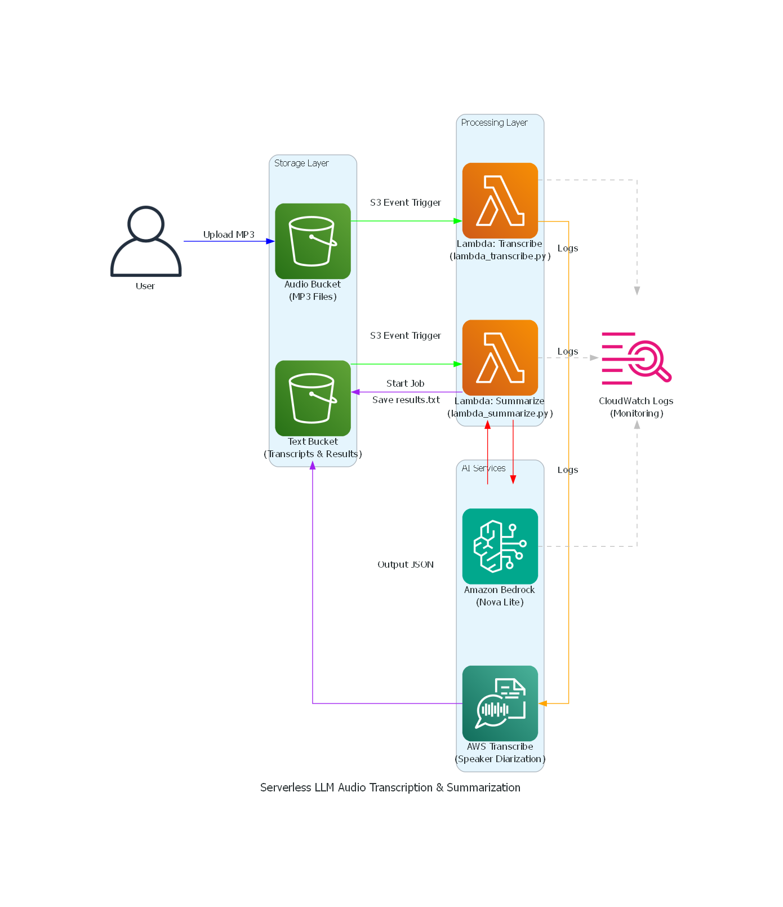

# Serverless LLM Audio Transcription and Summarization

A complete serverless solution for transcribing audio files and generating AI-powered summaries using AWS services. This project demonstrates an event-driven architecture that automatically processes audio files, transcribes them, and generates sentiment analysis and issue summaries using Amazon Bedrock.

## 🎯 Project Overview

This project implements a production-ready serverless pipeline that:

- **Transcribes audio files** using AWS Transcribe with speaker diarization
- **Generates intelligent summaries** using Amazon Bedrock (Nova Lite model)
- **Extracts sentiment and issues** from conversations automatically
- **Logs all operations** to CloudWatch for monitoring and debugging
- **Processes files automatically** via event-driven Lambda functions

## 🏗️ Architecture

The solution uses a serverless event-driven architecture:



### Architecture Flow

1. **Audio Upload**: Audio file (MP3) is uploaded to S3 audio bucket
2. **Transcription Trigger**: S3 event triggers Lambda function (`lambda_transcribe.py`)
3. **Transcription Job**: Lambda starts AWS Transcribe job with speaker diarization
4. **Transcript Storage**: Transcribe outputs JSON transcript to S3 text bucket
5. **Summarization Trigger**: S3 event triggers Lambda function (`lambda_summarize.py`)
6. **AI Summarization**: Lambda uses Amazon Bedrock to generate summary with sentiment and issues
7. **Results Storage**: Summary is saved back to S3 as `results.txt`
8. **Logging**: All Bedrock invocations are logged to CloudWatch for monitoring

### Diagram Generation

The architecture diagram above was generated using the [diagrams](https://github.com/mingrammer/diagrams) Python library, which creates cloud architecture diagrams using code. The diagram code is available in `generate_architecture_diagram.py`.

**To regenerate the diagram:**

1. Install the required dependencies:
   ```bash
   pip install diagrams
   ```

2. Install Graphviz (required for diagram rendering):
   - **Windows**: `winget install Graphviz.Graphviz` or download from [Graphviz website](https://graphviz.org/download/)
   - **macOS**: `brew install graphviz`
   - **Linux**: `sudo apt-get install graphviz` (Ubuntu/Debian) or `sudo yum install graphviz` (RHEL/CentOS)

3. Run the diagram generation script:
   ```bash
   python generate_architecture_diagram.py
   ```

The script uses AWS service icons from the diagrams library to visualize the complete event-driven pipeline, including:
- **Storage Layer**: S3 buckets for audio files and transcripts
- **Processing Layer**: Lambda functions for transcription and summarization
- **AI Services**: AWS Transcribe and Amazon Bedrock
- **Monitoring**: CloudWatch Logs for observability

Color-coded edges represent different types of data flows (uploads, triggers, API calls, logs) to make the architecture easy to understand at a glance.

## ✨ Features

- **Automatic Processing**: Fully automated pipeline with no manual intervention
- **Speaker Diarization**: Identifies and labels different speakers in conversations
- **Sentiment Analysis**: One-word sentiment classification (positive, negative, neutral)
- **Issue Extraction**: Automatically identifies and summarizes problems or friction points
- **Structured Output**: JSON-formatted summaries for easy integration
- **Comprehensive Logging**: CloudWatch integration for observability
- **Error Handling**: Robust error handling and logging throughout

## 🛠️ Technologies Used

- **AWS Lambda**: Serverless compute for event-driven processing
- **Amazon S3**: Object storage for audio files, transcripts, and results
- **AWS Transcribe**: Automatic speech recognition with speaker diarization
- **Amazon Bedrock**: Managed LLM service (Nova Lite model)
- **Amazon CloudWatch**: Logging and monitoring
- **Python 3.11+**: Programming language
- **Boto3**: AWS SDK for Python
- **Jinja2**: Template engine for prompt generation

## 📋 Prerequisites

Before you begin, ensure you have:

- **AWS Account** with appropriate permissions
- **Python 3.11+** installed
- **AWS CLI** configured with credentials
- **Jupyter Notebook** (for running notebooks)
- **IAM Permissions** for:
  - Lambda (create, update, invoke)
  - S3 (read, write, event notifications)
  - Transcribe (start jobs, read results)
  - Bedrock (invoke model)
  - CloudWatch (create log groups, write logs)
  - IAM (create roles and policies)

## 🚀 Setup Instructions

### 1. Clone the Repository

```bash
git clone <repository-url>
cd deeplearning.ai-serverless-llm
```

### 2. Install Dependencies

```bash
pip install -r requirements.txt
```

### 3. Configure AWS Credentials

Ensure your AWS credentials are configured:

```bash
aws configure
```

Or set environment variables:

```bash
export AWS_ACCESS_KEY_ID=your_access_key
export AWS_SECRET_ACCESS_KEY=your_secret_key
export AWS_DEFAULT_REGION=us-west-2
```

### 4. Create S3 Buckets

Create two S3 buckets (or use existing ones):

- **Audio Bucket**: For storing input audio files
- **Text Bucket**: For storing transcripts and results

### 5. Set Environment Variables

Set the following environment variables (or configure in your notebook):

```bash
export LEARNERS3BUCKETNAMEAUDIO=your-audio-bucket-name
export LEARNERS3BUCKETNAMETEXT=your-text-bucket-name
export LOGGINGROLEARN=arn:aws:iam::account-id:role/bedrock-logging-role
export LOGGINGBUCKETNAME=your-logging-bucket-name
```

### 6. Enable Bedrock Model Access

Ensure you have access to the Nova Lite model in Amazon Bedrock:

1. Go to AWS Console → Amazon Bedrock
2. Navigate to "Model access"
3. Request access for `us.amazon.nova-lite-v1:0`

## 📖 Usage

### Running the Notebooks

The project is organized into four notebooks that demonstrate the complete workflow:

1. **01_audio_transcription.ipynb**: Manual transcription and summarization workflow
2. **02_enable_logging.ipynb**: Configure CloudWatch logging for Bedrock
3. **03_deploy_lambda_summarize.ipynb**: Deploy the summarization Lambda function
4. **04_event_driven_pipeline.ipynb**: Deploy the transcription Lambda and test the full pipeline

### Manual Workflow

1. **Transcribe Audio** (Notebook 01):
   - Upload audio file to S3
   - Start transcription job
   - Wait for completion
   - Extract transcript with speaker labels

2. **Enable Logging** (Notebook 02):
   - Create CloudWatch log group
   - Configure Bedrock logging
   - Test logging functionality

3. **Deploy Summarization Lambda** (Notebook 03):
   - Review `lambda/lambda_summarize.py`
   - Deploy function with dependencies
   - Configure S3 trigger
   - Test with sample transcript

4. **Deploy Transcription Lambda** (Notebook 04):
   - Review `lambda/lambda_transcribe.py`
   - Deploy function
   - Configure S3 trigger
   - Upload audio file to test pipeline

### Automated Pipeline

Once both Lambda functions are deployed:

1. Upload an MP3 file to the audio S3 bucket
2. The transcription Lambda automatically starts a Transcribe job
3. When the transcript is ready, it's saved to the text bucket
4. The summarization Lambda automatically processes the transcript
5. Results are saved as `results.txt` in the text bucket

## 📁 Project Structure

```
├── README.md                          # Project documentation
├── requirements.txt                   # Python dependencies
├── .gitignore                        # Git ignore patterns
├── lambda/
│   ├── lambda_transcribe.py          # Transcription Lambda function
│   ├── lambda_summarize.py           # Summarization Lambda function
│   └── prompt_template.txt           # Jinja2 template for prompts
├── helpers/
│   ├── __init__.py                   # Package initialization
│   ├── lambda_helper.py              # Lambda deployment utilities
│   ├── s3_helper.py                  # S3 operations helper
│   ├── display_helper.py             # Display utilities
│   └── cloudwatch_helper.py          # CloudWatch logging helper
└── notebooks/
    ├── 01_audio_transcription.ipynb  # Manual transcription workflow
    ├── 02_enable_logging.ipynb       # CloudWatch logging setup
    ├── 03_deploy_lambda_summarize.ipynb  # Summarization Lambda deployment
    └── 04_event_driven_pipeline.ipynb    # Full pipeline deployment
```

## 🔧 Lambda Functions

### lambda_transcribe.py

Event-driven Lambda function that:
- Triggers on MP3 file upload to S3
- Starts AWS Transcribe job with speaker diarization
- Configures output to text bucket
- Handles errors gracefully

**Required IAM Permissions:**
- `transcribe:StartTranscriptionJob`
- `s3:GetObject` (source bucket)
- `s3:PutObject` (destination bucket)

### lambda_summarize.py

Event-driven Lambda function that:
- Triggers on transcript JSON file upload to S3
- Extracts transcript text with speaker labels
- Generates prompt using Jinja2 template
- Invokes Amazon Bedrock for summarization
- Saves results to S3

**Required IAM Permissions:**
- `bedrock:InvokeModel`
- `s3:GetObject`
- `s3:PutObject`

## 📊 Output Format

The summarization Lambda generates JSON output with the following structure:

```json
{
    "version": 0.1,
    "sentiment": "neutral",
    "issues": [
        {
            "topic": "pre-authorization amount",
            "summary": "The customer found the $1000 pre-authorization amount to be excessive."
        },
        {
            "topic": "additional charges",
            "summary": "The customer was concerned about the 10% service charge and 7% tax applied to the room rate."
        }
    ]
}
```

## 🔍 Monitoring and Logging

All Bedrock invocations are logged to CloudWatch for:
- **Request/Response Tracking**: Monitor all LLM calls
- **Performance Metrics**: Track latency and token usage
- **Error Debugging**: Identify and troubleshoot issues
- **Cost Analysis**: Track usage for billing

View logs in:
- CloudWatch Logs: `/my/amazon/bedrock/logs`
- S3 Logs: Configured logging bucket with prefix `amazon_bedrock_logs/`

## 🧪 Testing

### Test Transcription Lambda

1. Upload an audio file (e.g., `dialog.mp3`) to your audio bucket
2. Check CloudWatch logs for Lambda execution
3. Verify transcript JSON appears in your text bucket

### Test Summarization Lambda

1. Upload a transcript JSON file (ending with `-transcript.json`) to your text bucket
2. Check CloudWatch logs for processing
3. Verify `results.txt` appears in your text bucket

## 🐛 Troubleshooting

### Common Issues

**Lambda not triggering:**
- Verify S3 event notification is configured
- Check Lambda permissions for S3
- Ensure bucket and function are in same region

**Transcribe job fails:**
- Verify audio file format is supported (MP3, WAV, etc.)
- Check IAM permissions for Transcribe
- Ensure output bucket exists and is accessible

**Bedrock invocation fails:**
- Verify model access is granted in Bedrock console
- Check IAM permissions for Bedrock
- Ensure prompt template is included in Lambda package

**No logs appearing:**
- Verify CloudWatch log group exists
- Check IAM role for Bedrock logging
- Ensure logging configuration is applied

## 💼 Applications and Use Cases

This solution is particularly well-suited for **customer call summarization** and can be applied to various business scenarios:

### Customer Service & Support

- **Call Center Analytics**: Automatically transcribe and summarize customer support calls to identify common issues, sentiment trends, and service quality metrics
- **Quality Assurance**: Review customer interactions without listening to entire recordings, focusing on flagged issues and sentiment
- **Agent Training**: Extract key conversation points and issues to improve agent training programs
- **Complaint Resolution**: Quickly identify and categorize customer complaints for faster resolution

### Sales & Business Development

- **Sales Call Analysis**: Summarize sales conversations to track deal progress, identify objections, and improve conversion rates
- **Customer Feedback Extraction**: Automatically extract key feedback points from customer interviews and discovery calls
- **Meeting Summaries**: Generate concise summaries of business meetings and client calls for team alignment

### Healthcare & Legal

- **Patient Consultation Summaries**: Create structured summaries of patient consultations with key concerns and recommendations
- **Legal Case Documentation**: Transcribe and summarize client consultations, depositions, and case discussions
- **Compliance Monitoring**: Track conversations for regulatory compliance and documentation requirements

### Financial Services

- **Client Meeting Summaries**: Automatically document financial advisory sessions and investment discussions
- **Compliance Documentation**: Generate summaries of client interactions for regulatory compliance
- **Risk Assessment**: Identify concerns and issues mentioned during financial consultations

### Real Estate & Hospitality

- **Property Inquiry Analysis**: Summarize customer inquiries to understand preferences and requirements
- **Guest Feedback Processing**: Extract key issues and sentiment from guest service interactions
- **Booking Consultation Summaries**: Document booking conversations with preferences and special requests

### Benefits

- **Time Savings**: Reduce manual note-taking and review time by up to 90%
- **Consistency**: Standardized summaries ensure no important details are missed
- **Scalability**: Process thousands of calls automatically without additional resources
- **Actionable Insights**: Structured JSON output enables easy integration with CRM, ticketing systems, and analytics platforms
- **Sentiment Tracking**: Monitor customer satisfaction trends over time
- **Issue Identification**: Automatically flag conversations with negative sentiment or specific problem areas

## 🙏 Acknowledgments

- Built as part of the DeepLearning.ai Serverless LLM course
- Uses Amazon Bedrock Nova Lite model for summarization
- Leverages AWS serverless services for scalable architecture

## 📚 Additional Resources

- [AWS Lambda Documentation](https://docs.aws.amazon.com/lambda/)
- [Amazon Bedrock Documentation](https://docs.aws.amazon.com/bedrock/)
- [AWS Transcribe Documentation](https://docs.aws.amazon.com/transcribe/)
- [Generative AI on AWS](https://community.aws/generative-ai)

## 🤝 Contributing

Contributions are welcome! Please feel free to submit a Pull Request.

